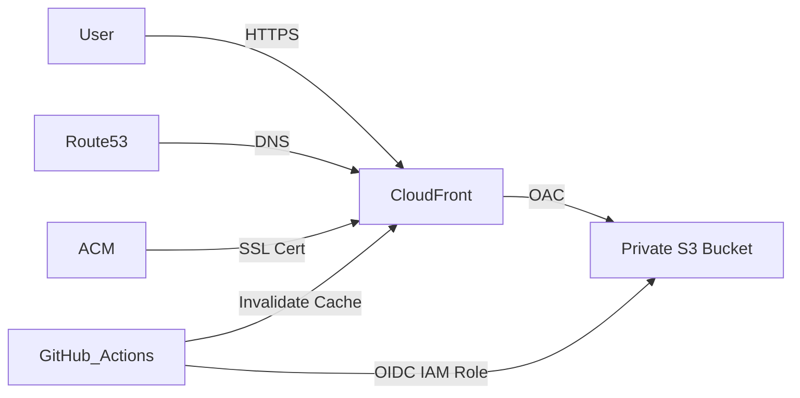

# Portfolio Infrastructure (IaC) - AWS & Terraform

[](https://www.terraform.io/)
[](https://aws.amazon.com/)
[](https://github.com/features/actions)

This repository contains the Infrastructure as Code (IaC) configuration for deploying and managing a professional portfolio website on AWS. Using Terraform, I have architected a highly available, secure, and cost-effective hosting environment.

## 🏗️ Architecture Overview

The infrastructure follows modern best practices for static site hosting:

- **Frontend Hosting**: AWS S3 Bucket configured for private access.
- **Content Delivery**: AWS CloudFront (CDN) with Origin Access Control (OAC) to securely serve content globally with low latency.
- **DNS Management**: AWS Route53 for domain and subdomain routing.
- **Security & SSL**: AWS Certificate Manager (ACM) for HTTPS/TLS encryption.
- **Deployment Security**: GitHub OIDC (OpenID Connect) for secure, keyless authentication between GitHub Actions and AWS.
- **State Management**: Remote Terraform state stored in S3 with DynamoDB for state locking.



## 🚀 Key Features

- **Keyless AWS Authentication**: Implemented GitHub OIDC to eliminate the need for long-lived IAM User Access Keys, significantly improving security posture.
- **Automated CI/CD Ready**: Configured IAM roles and policies to allow GitHub Actions to sync files to S3 and perform CloudFront cache invalidations automatically.
- **Robust State Management**: Built-in state locking and consistency using a dedicated DynamoDB table and S3 backend, preventing concurrent execution conflicts.
- **Modular Design**: Infrastructure is partitioned into reusable modules (`s3`, `cloudfront`, `route53`, `github-oidc`), making it scalable and maintainable.
- **Security-First Approach**: 
  - S3 bucket is strictly private; content is only accessible via CloudFront.
  - Least-privilege IAM policies for deployment.
  - Enforced HTTPS across all requests.

## 📁 Project Structure

```text
.
├── infra/                  # Main infrastructure configuration
│   ├── modules/            # Reusable core modules
│   │   ├── s3/             # S3 bucket provisioning
│   │   ├── cloudfront/     # CDN and OAC configuration
│   │   ├── route53/        # DNS records & hosting zones
│   │   └── github-oidc/    # IAM roles for GitHub Actions
│   ├── main.tf             # Root configuration file
│   ├── backend.tf          # Terraform S3 backend setup
│   ├── variable.tf         # Input variables
│   └── outputs.tf          # Important resource outputs
└── statelocking/           # Initial setup for Terraform backend
    ├── s3.tf               # State storage bucket
    └── dynamodb.tf         # Lock management table
```

## 🛠️ How to Use

### Prerequisites
- [Terraform](https://www.terraform.io/downloads) (latest)
- [AWS CLI](https://aws.amazon.com/cli/) configured with appropriate credentials

### 1. Initialize State Locking
Before running the main infrastructure, the backend resources must exist:
```bash
cd statelocking
terraform init
terraform apply
```

### 2. Deploy Infrastructure
Navigate to the `infra` directory to provision the website resources:
```bash
cd ../infra
terraform init
terraform plan
terraform apply
```

### 3. Connect to Frontend
Once the infrastructure is live, the GitHub repository for the frontend (referenced in `variable.tf`) will be able to authenticate and deploy using the provisioned IAM Role.

### 4. Key Outputs
After successful deployment, Terraform will output:
- `s3_bucket_name`: The name of the private bucket hosting your site.
- `cloudfront_domain_name`: The CloudFront URL for accessing your site.
- `iam_role_arn`: The IAM Role ARN to use in your GitHub Actions workflow for deployment.

## 👤 Author

**Rishi Majmudar**
- Website: [rishimajmudar.me](https://rishimajmudar.me)
- GitHub: [@Rishi-Cs-ms](https://github.com/Rishi-Cs-ms)

---
*Developed as part of a Cloud Engineering portfolio to showcase advanced AWS architecture and DevSecOps practices.*
