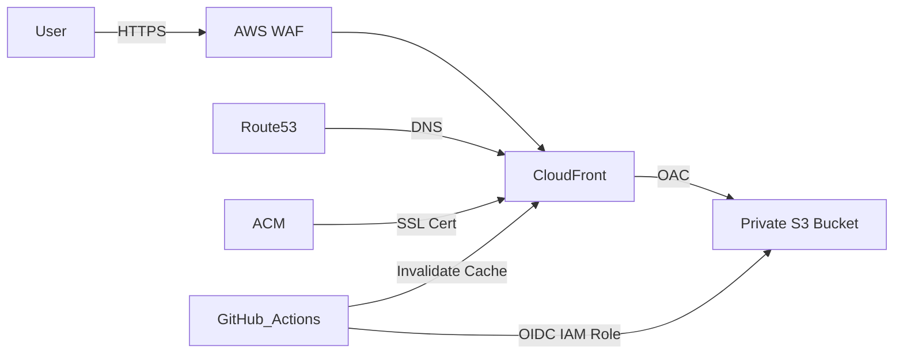

# Portfolio Infrastructure (IaC) - AWS & Terraform

[](https://www.terraform.io/)
[](https://aws.amazon.com/)
[](https://github.com/features/actions)

This repository contains the Infrastructure as Code (IaC) configuration for deploying and managing a professional portfolio website on AWS. Using Terraform, I have architected a highly available, secure, and cost-effective hosting environment.

## 🏗️ Architecture Overview

The infrastructure follows modern best practices for static site hosting:

- **Frontend Hosting**: AWS S3 Bucket configured for private access.
- **Content Delivery**: AWS CloudFront (CDN) with Origin Access Control (OAC) to securely serve content globally with low latency.
- **Edge Security**: AWS WAF (Web Application Firewall) integrated with CloudFront to protect against common web exploits (SQLi, XSS) and bot traffic.
- **DNS Management**: AWS Route53 for domain and subdomain routing.
- **Security & SSL**: AWS Certificate Manager (ACM) for HTTPS/TLS encryption.
- **Deployment Security**: GitHub OIDC (OpenID Connect) for secure, keyless authentication between GitHub Actions and AWS.
- **State Management**: Remote Terraform state stored in S3 with DynamoDB for state locking.



## 🚀 Key Features

- **Enterprise-Grade Edge Security**: 
  - **AWS WAF Integration**: Deployed a Web Application Firewall with AWS Managed Rule Sets (Core Rule Set, IP Reputation, Known Bad Inputs) and custom rate-limiting to mitigate DDoS and injection attacks.
  - **CloudFront OAC**: Enforced Origin Access Control to ensure S3 buckets remain strictly private, making the CDN the only gateway.
- **Keyless AWS Authentication**: Leveraged GitHub OIDC to eliminate long-lived IAM User Access Keys, adopting a temporary-credential security model.
- **Professional CI/CD Pipeline**: Configured granular IAM policies allowing GitHub Actions to securely sync assets to S3 and trigger CloudFront cache invalidations upon successful deployment.
- **Production-Ready State Management**: Engineered a robust Terraform backend using S3 for remote state storage and DynamoDB for atomic state locking, ensuring team-safe execution.
- **Clean, Modular Codebase**: Adhered to "Dry" principles by partitioning infrastructure into reusable core modules (`s3`, `cloudfront`, `route53`, `github-oidc`).

## 📁 Project Structure

```text
.
├── infra/                  # Core Infrastructure Layer
│   ├── modules/            # Decoupled Architectural Components
│   │   ├── s3/             # Origin Storage (Private Assets)
│   │   ├── cloudfront/     # CDN with OAC & WAF Enforcement
│   │   ├── route53/        # Managed DNS & Traffic Routing
│   │   └── github-oidc/    # IAM Federation for Secure CI/CD
│   ├── main.tf             # Resource Orchestration
│   ├── backend.tf          # Remote State Configuration
│   ├── provider.tf         # Multi-Region Setup & Providers
│   ├── variable.tf         # Parameterized Inputs
│   └── outputs.tf          # Resource Expose (for CI/CD consumption)
└── statelocking/           # Initial Bootstrap Infrastructure
    ├── s3.tf               # Terraform State Persistence
    ├── dynamodb.tf         # Distributed Locking Mechanism
    └── provider.tf         # Local Provider Configuration
```

## 🛠️ How to Use

### Prerequisites
- [Terraform](https://www.terraform.io/downloads) (latest)
- [AWS CLI](https://aws.amazon.com/cli/) configured with appropriate credentials

### 1. Initialize State Locking
Before running the main infrastructure, the backend resources must exist:
```bash
cd statelocking
terraform init
terraform apply
```

### 2. Deploy Infrastructure
Navigate to the `infra` directory to provision the website resources:
```bash
cd ../infra
terraform init
terraform plan
terraform apply
```

### 3. Connect to Frontend
Once the infrastructure is live, the GitHub repository for the frontend (referenced in `variable.tf`) will be able to authenticate and deploy using the provisioned IAM Role.

### 4. Key Outputs
After successful deployment, Terraform will output:
- `s3_bucket_name`: The name of the private bucket hosting your site.
- `cloudfront_domain_name`: The CloudFront URL for accessing your site.
- `iam_role_arn`: The IAM Role ARN to use in your GitHub Actions workflow for deployment.

## 👤 Author

**Rishi Majmudar**
*Cloud Security & DevOps Engineer*

- **Portfolio**: [rishimajmudar.me](https://rishimajmudar.me)
- **GitHub**: [@Rishi-Cs-ms](https://github.com/Rishi-Cs-ms)
- **LinkedIn**: [Rishi Majmudar](https://linkedin.com/in/rishimajmudar)

---
*Developed as part of a Cloud Engineering portfolio to showcase advanced AWS architecture and DevSecOps practices.*
